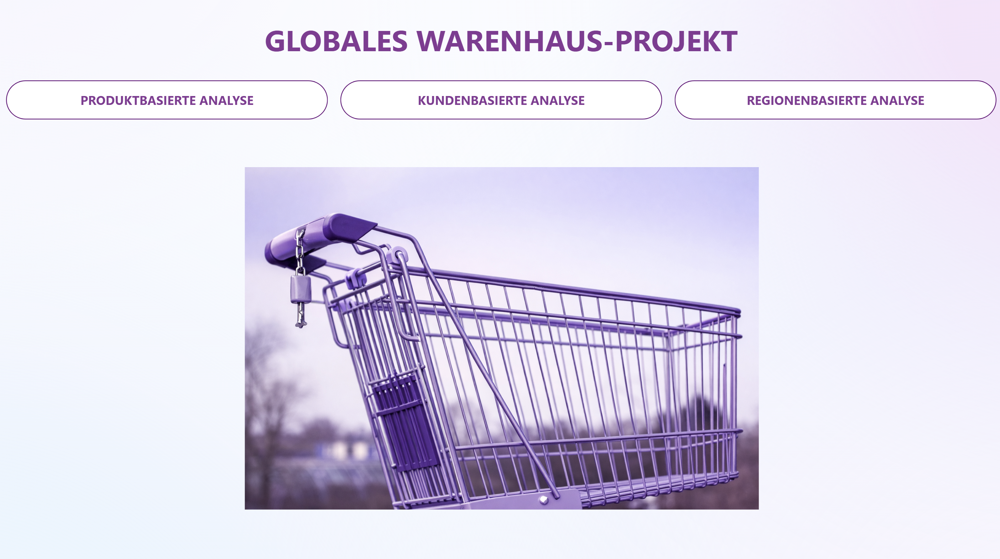
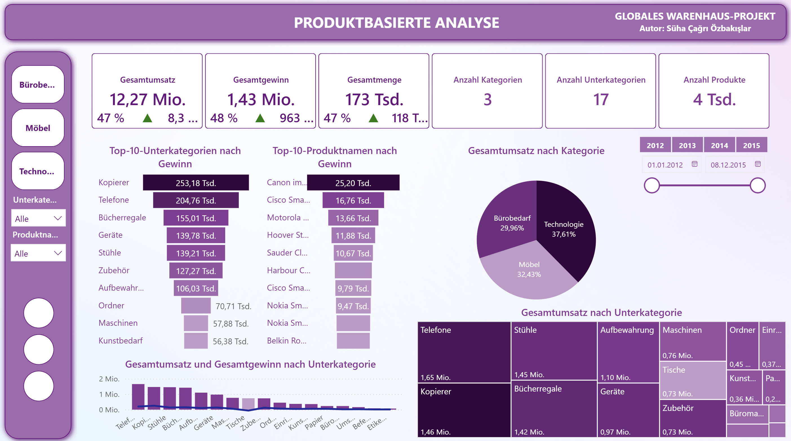
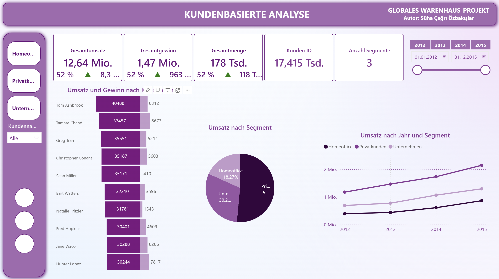
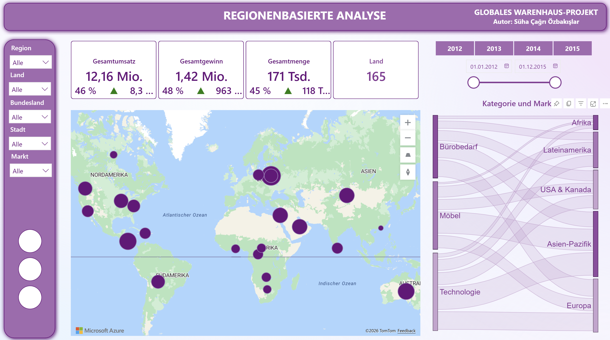

# 📖 **Diller:** [Deutsch](README.md) | **Türkçe**

# 🛒 Global Mağaza Projesi

Bu proje, kurgusal bir global mağazanın satış verilerini görselleştiren ve analiz eden interaktif bir Power BI gösterge panelidir. Temel amaç, üç ana alan hakkında anlamlı içgörüler elde etmektir: bireysel ürün ve kategorilerin performansı, müşterilerin satın alma davranışı ve segmentasyonu ile satışların dünya genelindeki coğrafi dağılımı. Gösterge paneli, tutarlı bir mor renk temasıyla tasarlanmış olup interaktif filtreler ve ortak bir navigasyon sayfası sayesinde sezgisel bir kullanım deneyimi sunmaktadır.

## 📸 Ekran Görüntüleri

### Giriş Sayfası

### Ürün Bazlı Analiz

### Müşteri Bazlı Analiz

### Bölge Bazlı Analiz

## 🛠️ Kullanılan Araçlar

- **Power BI Desktop**
- **DAX**
- **Power Query**

## 📧 İletişim

**Süha Çağrı Özbakışlar**

